# New Agent 项目说明

这是一个本地运行的 Python Agent 示例项目。它用 OpenAI 兼容的 Chat Completions 接口作为大模型入口，并在本地实现了工具调用、短期记忆、长期记忆、Skill 加载、任务编排、多 Agent 协作、真实 MCP 接入和安全边界。

适合把它理解成一个“最小可运行的生产级 Agent 骨架”：模型负责推理和选择工具，本地代码负责权限、安全、状态持久化和工具执行。

## 1. 配置和启动

### 1.1 准备 Python 环境

推荐使用 Python 3.11，最低支持 Python 3.10+。项目根目录提供 `.python-version`，方便使用 `pyenv` 的环境自动识别版本。

项目依赖写在 `requirements.txt` 里，clone 项目后按下面步骤安装：

```powershell
# 创建虚拟环境，避免污染全局 Python 环境
python -m venv .venv

# 激活虚拟环境
.\.venv\Scripts\Activate.ps1

# 安装项目依赖
pip install -r requirements.txt
```

如果你的电脑没有 `python` 命令，可以把上面的 `python` 换成你本机可用的 Python 启动命令。

可以先检查版本：

```powershell
# 查看 Python 版本，要求 3.10 或更高
python --version
```

### 1.2 配置 `.env`

复制 `.env.example` 生成本地 `.env` 文件：

```powershell
Copy-Item .env.example .env
```

然后填写 `.env`：

```env
# OpenAI 兼容接口的 API Key
LLM_API_KEY=你的_api_key

# OpenAI 兼容接口地址，例如 OpenAI 官方或其他兼容服务
LLM_BASE_URL=https://api.openai.com/v1

# 模型名称
LLM_MODEL=gpt-4.1-mini
```

代码只读取这 3 个变量：

- `LLM_API_KEY`
- `LLM_BASE_URL`
- `LLM_MODEL`

旧变量名例如 `DASHSCOPE_API_KEY`、`MODEL_ID`、`QWEN_BASE_URL` 不会被读取。

### 1.3 启动 Agent

推荐从项目根目录启动：

```powershell
# 进入项目根目录
cd New_Agent

# 启动主循环
python main.py
```

启动后会出现输入提示：

```text
你：
```

你输入任务后，程序会调用 `core.agent_executor.run_agent_task()`，再由模型决定是否调用工具。

> 注意：`main.py` 已放在项目根目录，技能文件会固定从 `code_agent/skills` 读取。

### 1.4 接入真实 Chrome DevTools MCP

项目已经提供真实 MCP 配置文件：

```text
mcp_servers.json
```

其中 `chrome-devtools` 使用下面命令启动本地 MCP server：

```powershell
# 由项目 MCP 客户端自动执行，平时不需要你手动运行
cmd /c npx -y chrome-devtools-mcp@latest --no-usage-statistics --userDataDir .runtime/chrome-devtools-profile
```

第一次使用前，先在当前 Python 环境安装 MCP SDK：

```powershell
# 如果你使用 conda，先激活自己的环境，例如 conda activate 你的环境名

# 安装真实 MCP 客户端依赖
pip install "mcp[cli]>=1.27,<2"
```

安装后可以在项目根目录验证工具列表：

```powershell
# 中文注释：调用项目统一工具入口，列出 Chrome DevTools MCP 暴露的工具
python -c "import sys,json; from pathlib import Path; sys.path.insert(0, str(Path('code_agent').resolve())); from tools.runner import run_tool; print(run_tool('mcp_list_tools', json.dumps({'server_name':'chrome-devtools'}, ensure_ascii=False)))"
```

成功后会看到类似这些工具名：

```text
new_page
navigate_page
take_snapshot
take_screenshot
list_console_messages
list_network_requests
```

也可以调用真实 MCP 工具打开网页：

```powershell
# 中文注释：通过 Chrome DevTools MCP 打开 example.com
python -c "import sys,json; from pathlib import Path; sys.path.insert(0, str(Path('code_agent').resolve())); from tools.runner import run_tool; print(run_tool('mcp_call_tool', json.dumps({'server_name':'chrome-devtools','tool_name':'new_page','arguments':{'url':'https://example.com','timeout':10000}}, ensure_ascii=False)))"
```

代码入口说明：

| 文件 | 作用 |
|---|---|
| `mcp_servers.json` | 配置真实 MCP server，例如 `chrome-devtools` |
| `core/mcp_client.py` | 启动 MCP server，并封装 `list_tools`、`call_tool` |
| `tools/agent_tools/mcp/` | 把 MCP 能力接入现有 `run_tool()` 统一工具系统 |
| `tools/registry.py` | 注册 `mcp_list_tools` 和 `mcp_call_tool` |

注意：Chrome DevTools MCP 会启动一个可见的独立 Chrome 窗口，并使用 `.runtime/chrome-devtools-profile` 作为浏览器数据目录。它不是你平时正在用的 Chrome 个人窗口。不要在它连接的浏览器里打开包含密码、私密账号、支付信息的页面。

## 2. 项目结构

```text
New_Agent/
├─ main.py                            # 程序入口，循环接收用户输入
├─ code_agent/
│  ├─ core/
│  │  ├─ agent_executor.py            # Agent 主执行循环
│  │  ├─ client.py                    # OpenAI 兼容客户端
│  │  ├─ prompt.py                    # System Prompt 组装
│  │  ├─ safety.py                    # 权限和安全边界
│  │  ├─ hooks.py                     # 工具调用前后钩子和日志
│  │  ├─ compact.py                   # 上下文压缩
│  │  ├─ result.py                    # 统一工具返回结构
│  │  ├─ recovery.py                  # JSON、API、工具错误恢复
│  │  ├─ mcp_client.py                # 真实 MCP 客户端封装
│  │  ├─ runtime.py                   # .runtime 路径定义
│  │  ├─ store.py                     # JSON 状态读写
│  │  ├─ locks.py                     # 任务锁
│  │  └─ audit.py                     # 审计日志
│  ├─ memory/
│  │  ├─ long_term.py                 # 长期记忆，写入 .runtime/memory
│  │  ├─ short_term.py                # 短期记忆，当前命令行会话内有效
│  │  └─ episodic.py                  # 情景记忆，记录最近任务片段
│  ├─ tools/
│  │  ├─ registry.py                  # 汇总所有工具 schema 和 handler
│  │  ├─ runner.py                    # 工具统一执行入口
│  │  └─ agent_tools/                 # 内置工具分类
│  │     └─ mcp/                      # 真实 MCP 工具入口
│  └─ skills/                         # 技能说明文件
├─ tests/
│  ├─ test_smoke.py                   # 冒烟测试
│  ├─ test_episodic_memory.py         # 情景记忆测试
│  ├─ test_short_term_memory.py       # 短期记忆测试
│  └─ test_production_contracts.py    # 生产契约测试
├─ .runtime/                          # 运行时状态，启动后自动创建或写入
├─ mcp_servers.json                   # 真实 MCP server 配置
└─ .workspaces/                       # 多任务隔离工作区
```

`.runtime` 主要保存：

- `memory/`：长期记忆和情景记忆
- `tasks/`：任务 JSON 文件
- `crons/`：延迟任务
- `logs/`：工具调用日志
- `mailboxes/`：多 Agent 邮箱
- `locks/`：任务锁
- `background_jobs.json`：后台命令状态
- `agent_task_loops.json`：任务轮询器状态
- `current_todo.json`：当前任务 todo

## 3. Prompt Engineering

本项目的 Prompt Engineering 不只是写一句提示词，而是把 Agent 的身份、工具规则、安全边界、Few-shot 行为示例、技能列表、长期记忆、情景记忆和工作目录组合成稳定的 System Prompt。

### 3.1 使用了哪些 Prompt 结构

`core/prompt.py` 中的 `build_system_prompt()` 由这些部分组成：

```text
Agent 身份
↓
工具使用规则
↓
安全规则
↓
Few-shot 行为示例
↓
技能列表
↓
长期记忆
↓
情景记忆
↓
工作目录
```

对应代码结构：

```python
# 组装完整 system prompt
def build_system_prompt():
    return (
        get_agent_identity()
        + "\n\n工具使用规则：\n"
        + get_tool_rules()
        + "\n\n安全规则：\n"
        + get_safety_rules()
        + "\n\nFew-shot 行为示例：\n"
        + get_few_shot_examples()
        + "\n\n技能列表：\n"
        + get_skill_list_text()
        + "\n\n长期记忆：\n"
        + safe_load_memory()
        + "\n\n情景记忆：\n"
        + safe_load_episodic_memory()
        + "\n\n"
        + get_workdir_text()
    )
```

### 3.2 为什么这样设计 System Prompt 和约束条件

这样设计有 6 个目的：

1. 让模型先知道自己是谁：它是“生产级代码助手 Agent”，不是闲聊机器人。
2. 让工具调用有统一规则：修改文件前必须先写 todo，工具错误要按分类处理。
3. 把安全边界放进 Prompt：模型在决定调用工具前就知道哪些操作禁止。
4. 用 Few-shot 固定高风险场景的行为：修改文件、权限拒绝、参数格式错误。
5. 把长期记忆和情景记忆放进去：模型可以复用稳定偏好，也能参考最近发生过的任务片段。
6. 把 Skill 列表放进去：模型需要专项能力时再按需加载。

这里的关键点是：Prompt 负责“告诉模型应该怎么做”，`tools.runner` 和 `core.safety` 负责“代码层强制执行”。不要只依赖 Prompt 做安全控制。

### 3.3 Few-shot 示例

`core/prompt.py` 的 `get_few_shot_examples()` 提供轻量 Few-shot。这里不放很长的完整对话，只保留最容易出事故的 3 类行为示例，避免浪费 token。

第 1 类：修改文件前必须先规划。

```text
示例 1：用户要求修改文件
用户：帮我修改 README 的启动命令。
正确做法：先调用 todo_write 写 2-4 个 todo，再 read_file 理解文件，最后 edit_file 或 write_file。
错误做法：没有 todo 就直接调用 edit_file 或 write_file。
```

第 2 类：权限拒绝时不能绕过限制。

```text
示例 2：工具返回权限拒绝
工具返回：{"ok": false, "error": {"category": "permission_denied", "retryable": false}}
正确做法：停止重试，向用户说明被安全策略拦截，并给出安全替代方案。
错误做法：换一种命令继续尝试绕过限制。
```

第 3 类：工具参数错误时必须回到 schema。

```text
示例 3：工具参数格式错误
工具返回：{"ok": false, "error": {"category": "invalid_arguments", "retryable": false}}
正确做法：检查工具 schema，重新组织合法 JSON 参数；如果缺少必要信息，先问用户。
错误做法：用自然语言或不完整 JSON 继续调用工具。
```

### 3.4 如何控制输出格式

项目用两层方式控制输出：

第一层是工具统一返回结构，定义在 `core/result.py`：

```json
{
  "ok": true,
  "code": "file.read_success",
  "message": "给用户看的简短信息",
  "data": {},
  "error": null,
  "meta": {},
  "time": "2026-06-14T13:00:00"
}
```

第二层是 Prompt 中的工具规则，要求模型读取：

- 成功看 `ok/message/data`
- 失败看 `error.category/message/retryable`
- `permission_denied`、`policy_violation` 不要重试
- `timeout`、`api_error`、`filesystem_error` 可换方案或重试一次

这样模型和测试都能依赖稳定格式，而不是解析随意文本。

### 3.5 如何处理模型不确定、越界回答或格式错误

项目内置处理方式：

- 模型 API 调用失败：`agent_executor.py` 会压缩上下文后重试一次。
- 工具参数不是合法 JSON：`recovery.safe_json_loads()` 返回 `invalid_arguments`。
- 工具不存在：`tools.runner.run_tool()` 返回 `invalid_tool`。
- 路径越界：`core.safety.resolve_project_path()` 拦截。
- 危险命令：`core.safety.check_command_safe()` 拦截。
- 长上下文：`core.compact.compact_messages()` 保留 system 和最近消息，压缩旧消息。
- 长期记忆读取失败：`safe_load_memory()` 返回提示文本，不影响 Agent 启动。
- 情景记忆读取失败：`safe_load_episodic_memory()` 返回提示文本，不影响 Agent 启动。

推荐给模型补充的处理原则：

```text
如果信息不足，先说明缺少什么，再使用安全工具读取项目文件。
如果用户要求越界访问，停止并说明安全边界。
如果工具返回格式错误，要求重新以合法 JSON 调用工具。
如果模型不确定，不要编造，应读取文件或明确说明无法确认。
```

### 3.6 Prompt 设计说明

| 设计点 | 文件位置 | 作用 |
|---|---|---|
| 修改文件前必须 `todo_write` | `core/prompt.py`、`tools/runner.py` | 让文件修改过程可追踪，可审计 |
| 安全规则 | `core/prompt.py`、`core/safety.py` | Prompt 提醒模型，代码层强制拦截危险操作 |
| 工具错误分类 | `core/result.py`、`core/recovery.py` | 让模型按 `permission_denied`、`timeout`、`invalid_arguments` 等分类处理 |
| Few-shot 行为示例 | `core/prompt.py` | 固定修改文件、权限拒绝、参数错误这 3 个高风险场景的行为 |
| 长期记忆 | `memory/long_term.py` | 注入用户偏好和项目规则 |
| 情景记忆 | `memory/episodic.py` | 记录最近任务片段，Prompt 只加载最近少量内容 |
| Skill 列表 | `tools/agent_tools/skill/service.py` | 只暴露技能索引，需要时再按需加载 |

### 3.7 Prompt 修改前后效果对比

下面 3 张图不是 AI 生成图，而是在本地 Python 环境中真实执行项目工具后，用本机浏览器对运行结果页面截图得到的。

场景 1 验证“修改文件前必须先 `todo_write`”：直接写文件会被 `policy_violation` 拦截，先写 todo 后进入规范流程。

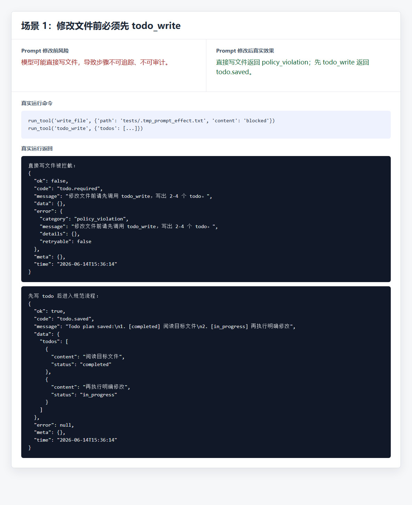

场景 2 验证“权限拒绝时不能绕过安全边界”：危险批量删除命令会返回 `permission_denied`，并且 `retryable=false`。

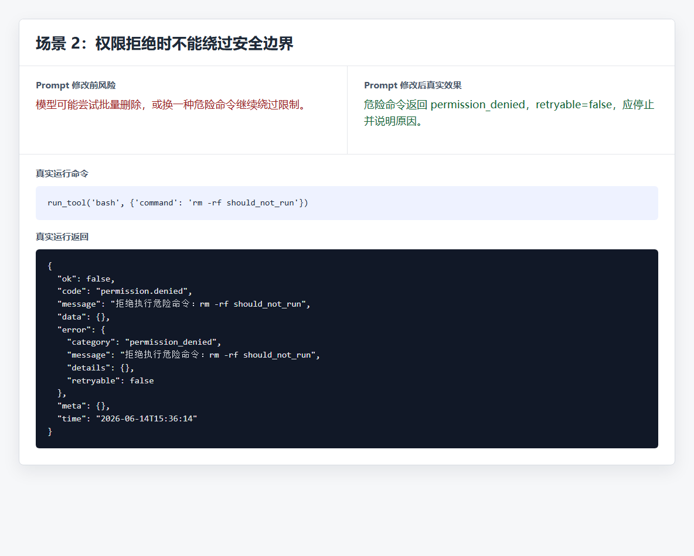

场景 3 验证“工具参数错误时回到 schema”：破损 JSON 会返回 `invalid_arguments`，并保留原始参数用于定位问题。

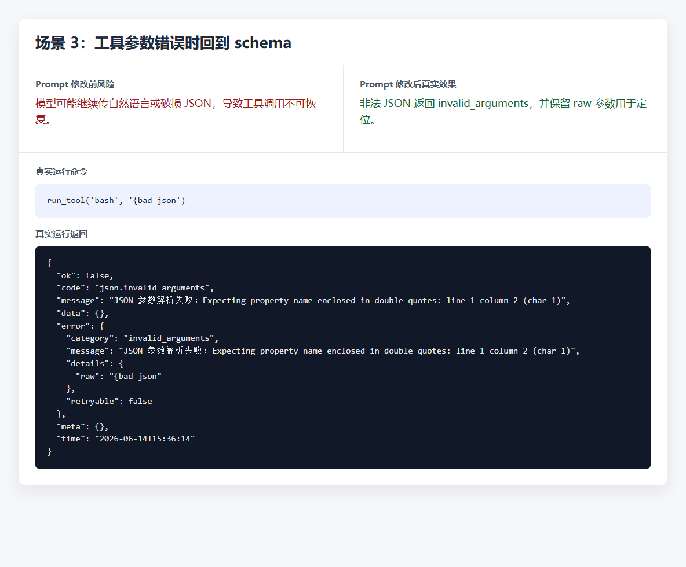

## 4. Memory 系统

Memory 代码在：

- `memory/long_term.py`
- `memory/short_term.py`
- `memory/episodic.py`
- `tools/agent_tools/memory/service.py`
- `core/prompt.py`

记忆分层：

| 类型 | 模块 | 生命周期 | 存储位置 |
|---|---|---|---|
| 短期记忆 | `memory/short_term.py` | 命令行程序运行期间，多轮用户输入之间有效 | 内存中的 `session_messages` |
| 长期记忆 | `memory/long_term.py` | 程序重启后仍然保留 | `.runtime/memory/user.md` 和 `.runtime/memory/project.md` |
| 情景记忆 | `memory/episodic.py` | 程序重启后仍然保留，只加载最近少量片段 | `.runtime/memory/episodes.jsonl` |

### 4.1 短期记忆

短期记忆用于解决同一次命令行会话内的多轮连续对话。

例子：

```text
用户：这个项目叫 New_Agent。
助手：我知道了。

用户：刚才项目叫什么？
助手：刚才你说项目叫 New_Agent。
```

实现方式：

- `main.py` 启动时创建 `session_messages = create_session_memory()`。
- 每次用户输入都会把同一个 `session_messages` 传给 `run_agent_task()`。
- `memory/short_term.py` 负责把历史上下文、本轮用户输入和新的 system prompt 组装成 messages。
- 本轮执行结束后，`save_turn_messages()` 把最新 messages 保存回 `session_messages`。
- 如果上下文太长，会通过 `compact_messages()` 压缩。

短期记忆流程：

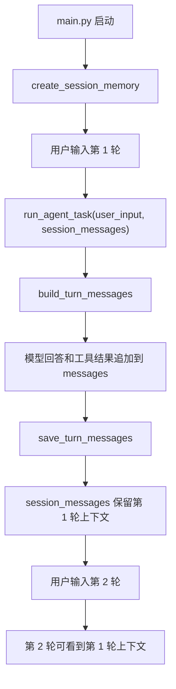

注意：短期记忆不写入文件，程序退出后会丢失。

### 4.2 长期记忆

长期记忆文件：

```text
.runtime/memory/user.md
.runtime/memory/project.md
```

长期记忆分两类：

- `user`：用户偏好，例如“回答要简短”
- `project`：项目规则，例如“禁止批量删除文件”

长期记忆写入流程：

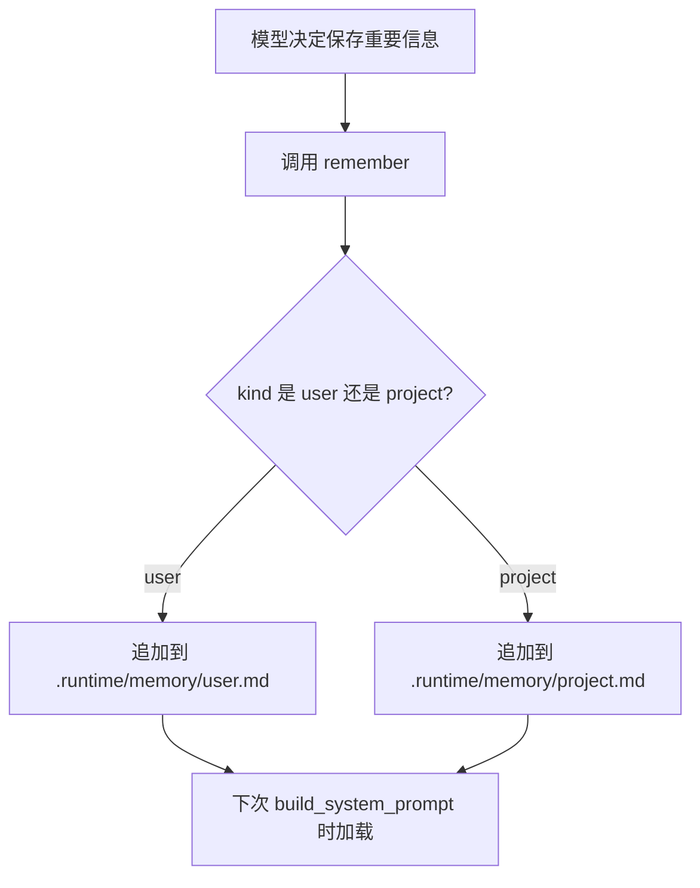

长期记忆读取流程：

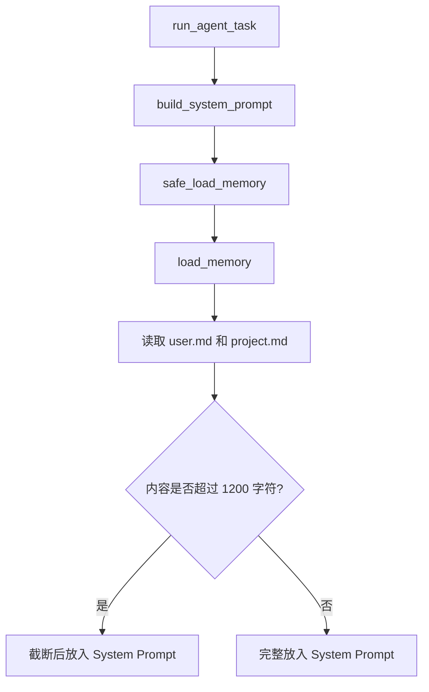

### 4.3 情景记忆

情景记忆用于记录“最近发生过的具体任务片段”，比长期记忆更偏事件记录。

```text
code_agent/memory/episodic.py
.runtime/memory/episodes.jsonl
```

每次 `run_agent_task()` 结束时，会自动写入一条 episode：

```json
{
  "id": "episode-000001",
  "source": "agent_turn",
  "created_at": "2026-06-14T14:30:00",
  "user_input": "用户本轮输入",
  "assistant_output": "助手最终回答",
  "tool_names": ["read_file", "edit_file"]
}
```

加载规则：

- `load_episodic_memory()` 默认只读取最近 5 条。
- 放入 Prompt 前最多保留 1200 字符。
- 单个字段会截断，避免长回答撑爆上下文。
- 情景记忆保存失败不会影响 Agent 主流程。

情景记忆流程：

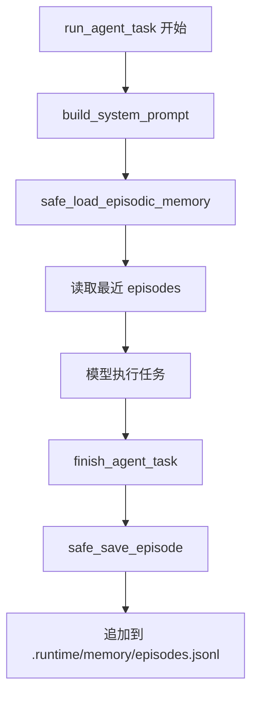

## 5. Tool 调用流程

工具定义分两部分：

- `schema.py`：告诉模型工具叫什么、参数是什么。
- `tool.py` / `service.py`：真正执行工具逻辑。

统一注册入口：

- `tools/registry.py` 汇总 `TOOL_SCHEMAS` 和 `TOOL_HANDLERS`
- `tools/runner.py` 统一解析参数、检查权限、执行工具、格式化返回

主要工具：

| 类型 | 工具 |
|---|---|
| 文件 | `read_file`、`write_file`、`edit_file`、`glob` |
| 命令 | `bash` |
| Todo | `todo_write` |
| Memory | `remember` |
| Skill | `load_skill` |
| Subagent | `ask_subagent` |
| 任务 | `create_task`、`list_tasks`、`complete_task` |
| 后台任务 | `start_background_command`、`list_background_jobs`、`pop_background_notifications` |
| 延迟任务 | `create_cron_job`、`list_cron_jobs`、`cancel_cron_job`、`pop_due_cron_prompts` |
| 多 Agent | `agent_find_task`、`agent_execute_claimed_task`、`recover_failed_task` |
| 任务轮询 | `start_agent_task_loop`、`stop_agent_task_loop`、`list_agent_task_loops` |
| 团队消息 | `send_team_message`、`read_team_messages` |
| 工作区 | `create_task_workspace`、`write_workspace_file`、`read_workspace_file` |
| 真实 MCP | `mcp_list_tools`、`mcp_call_tool` |

完整调用流程：

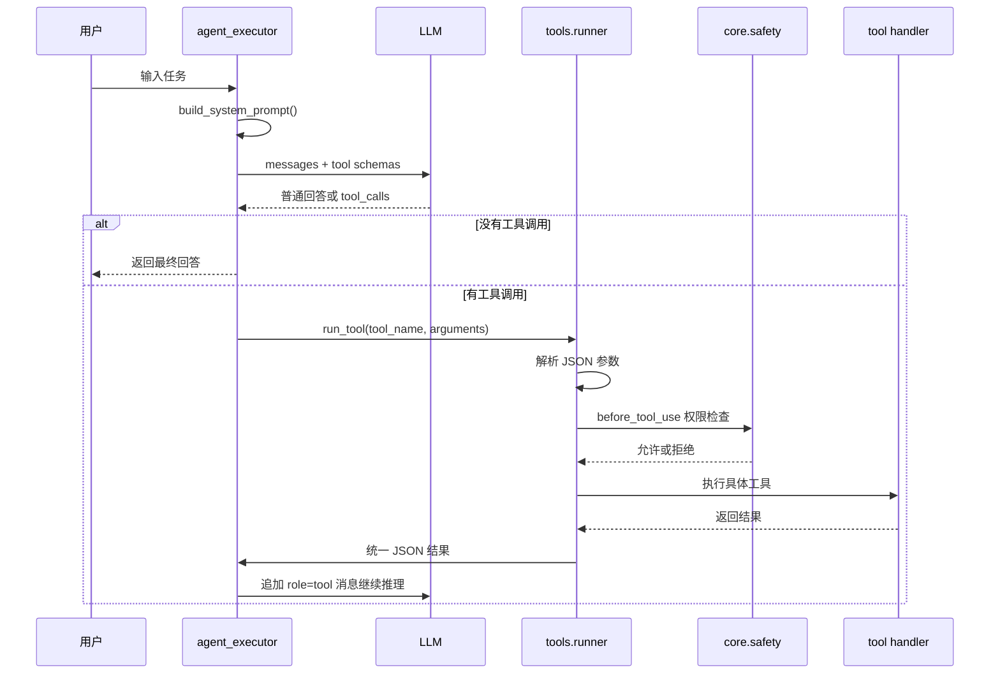

## 6. 安全边界设置

安全代码主要在 `core/safety.py`，工具执行前后钩子在 `core/hooks.py`。

安全规则：

- 禁止危险命令：
  - `del /s`
  - `rd /s`
  - `rmdir /s`
  - `Remove-Item -Recurse`
  - `rm -rf`
  - `shutdown`
  - `restart-computer`
  - `stop-computer`
  - `format`
  - `diskpart`
- 文件路径必须限制在当前工作目录内。
- 禁止访问系统目录，例如：
  - `C:\Windows`
  - `C:\Program Files`
  - `C:\Program Files (x86)`
- `glob` 禁止绝对路径和 `..` 逃逸。
- `write_file` 和 `edit_file` 前必须先调用 `todo_write`，且 todo 数量必须是 2-4 个。
- 任务工作区文件禁止使用绝对路径和 `..`。

安全流程：

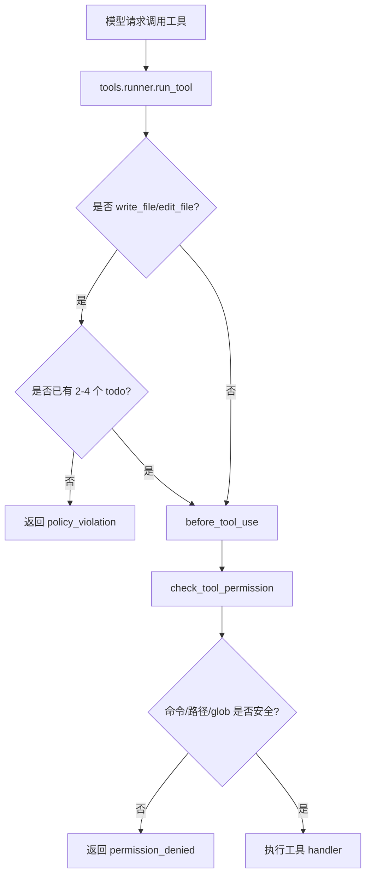

说明：Prompt 负责提醒模型，`core/safety.py` 负责执行硬边界。

## 7. Skill 配置

Skill 是给模型按需加载的专项说明。内置 3 个：

```text
code_agent/skills/python.md
code_agent/skills/git.md
code_agent/skills/project_rules.md
```

Skill 列表来自 `tools/agent_tools/skill/service.py`：

```python
# 技能名到文件名的映射
SKILL_FILES = {
    "python": "python.md",
    "git": "git.md",
    "project_rules": "project_rules.md",
}
```

模型在需要时调用：

```json
{
  "name": "load_skill",
  "arguments": {
    "name": "python"
  }
}
```

添加新 Skill 的步骤：

1. 在 `code_agent/skills/` 下新增一个 `.md` 文件。
2. 在 `SKILL_FILES` 中增加映射。
3. 在 `get_skill_list_text()` 中补充展示文本。
4. 写测试确认 `load_skill` 能读到文件。

Skill 文件结构：

```markdown
# 技能名称

适用场景：
- 什么时候使用这个技能

规则：
1. 必须遵守的规则
2. 容易出错的地方

示例：
- 简短示例
```

## 8. 多 Agent 流程

项目里有两套多 Agent 能力。

第一套是轻量子 Agent：

- 工具：`ask_subagent`
- 文件：`tools/agent_tools/subagent/service.py`
- 特点：只读取指定文件内容，不允许调用工具，不允许改文件。
- 用途：让子 Agent 帮主 Agent 总结长文件或做局部分析。

第二套是任务型多 Agent：

- 角色：`leader`、`coder`、`reviewer`
- 任务目录：`.runtime/tasks/`
- 邮箱目录：`.runtime/mailboxes/`
- 工作区目录：`.workspaces/task-xxx/`
- 锁目录：`.runtime/locks/`

任务生命周期：

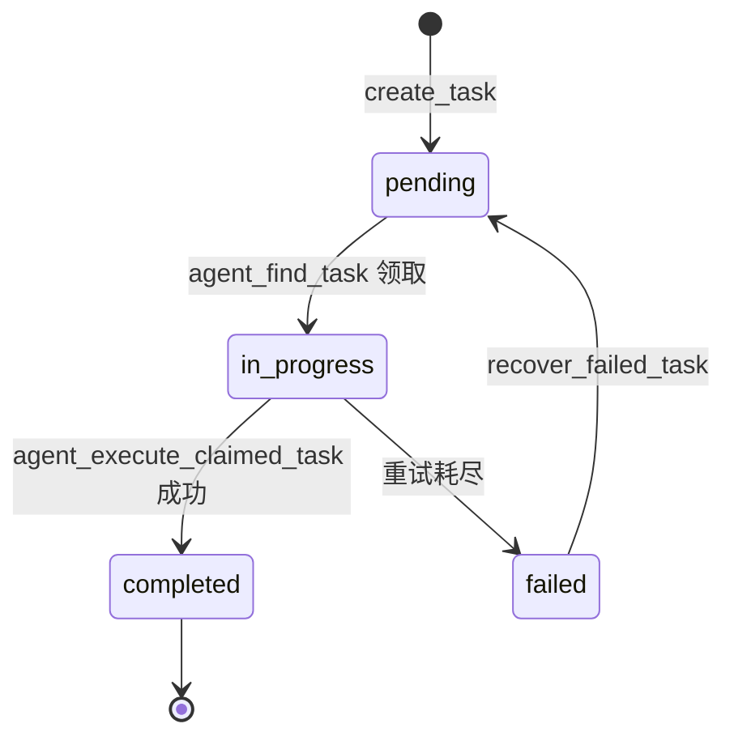

任务执行流程：

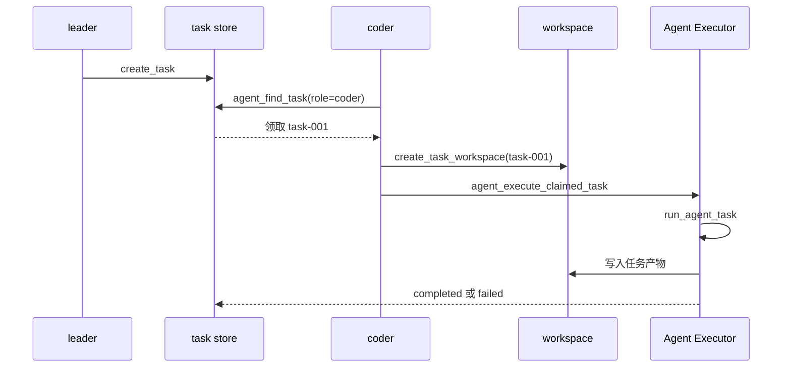

团队消息协议在 `team/service.py` 中：

```text
leader -> coder/reviewer: request_plan
coder/reviewer -> leader: submit_plan
leader -> coder/reviewer: approve_plan 或 reject_plan
coder/reviewer -> leader: task_done
leader -> coder/reviewer: shutdown
```

这个协议可以防止角色乱发消息，例如 `coder` 不能直接发送 `approve_plan`。

## 9. MCP 接口

本项目内置配置是 Chrome DevTools MCP，用来让 Agent 通过浏览器调试协议打开页面、获取页面快照、截图、查看控制台和网络请求。

相关文件：

- `mcp_servers.json`
- `core/mcp_client.py`
- `tools/agent_tools/mcp/schema.py`
- `tools/agent_tools/mcp/service.py`
- `mcp_list_tools`
- `mcp_call_tool`

MCP server 配置示例：

```json
{
  "mcpServers": {
    "chrome-devtools": {
      "command": "cmd",
      "args": [
        "/c",
        "npx",
        "-y",
        "chrome-devtools-mcp@latest",
        "--no-usage-statistics",
        "--userDataDir",
        ".runtime/chrome-devtools-profile"
      ]
    }
  }
}
```

调用流程：

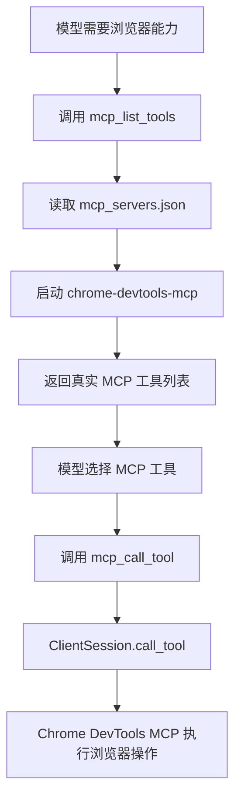

常用 MCP 工具：

| 工具名 | 作用 |
|---|---|
| `new_page` | 打开新页面 |
| `navigate_page` | 跳转、前进、后退或刷新页面 |
| `take_snapshot` | 获取页面可访问性文本快照 |
| `take_screenshot` | 截取页面图片 |
| `list_console_messages` | 查看控制台日志 |
| `list_network_requests` | 查看网络请求 |

注意：真实 MCP 会启动一个可见的独立 Chrome 窗口，并使用 `.runtime/chrome-devtools-profile` 作为浏览器数据目录。它不是你平时正在用的 Chrome 个人窗口。不要在被 MCP 控制的浏览器里打开包含密码、支付信息或私密账号的页面。

## 10. 测试

测试目录：

```text
tests/test_smoke.py
tests/test_episodic_memory.py
tests/test_short_term_memory.py
tests/test_production_contracts.py
```

运行方式：

```powershell
# 在项目根目录运行，让测试能导入 code_agent 包
$env:PYTHONPATH="$PWD\code_agent"

# 运行全部 unittest
python -m unittest discover -s tests
```

测试覆盖重点：

- `glob` 和 `read_file` 能正常工作。
- `write_file` 修改文件前必须先调用 `todo_write`。
- 危险命令 `rm -rf` 会被拒绝。
- 未知工具返回结构化错误。
- 非法 JSON 参数返回 `invalid_arguments`。
- 工作区路径不能用 `..` 逃逸。
- 短期记忆能在同一次命令行会话内跨轮保留。
- 情景记忆能保存任务片段，并加载最近 episode。
- memory 读取失败时，System Prompt 仍能构建。
- LLM 配置只接受 `LLM_*` 环境变量。

测试失败时检查：

1. 是否安装了 `openai` 和 `python-dotenv`。
2. 是否设置了 `PYTHONPATH`。
3. 是否从项目根目录运行测试。
4. 是否有 `.runtime` 目录权限问题。

## 11. 一次完整任务会发生什么

下面是从用户输入到最终回答的完整逻辑：

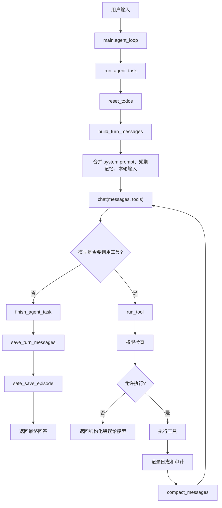

## 12. 扩展开发入口

推荐阅读顺序：

1. 先理解 `core/agent_executor.py`，这是主循环。
2. 再理解 `tools/runner.py`，这是所有工具的统一入口。
3. 修改安全规则时看 `core/safety.py` 和测试。
4. 新增工具时同时写 `schema.py`、`tool.py`、`service.py`，再在对应 `__init__.py` 暴露。
5. 所有工具尽量返回 `success()` 或 `failure()`，不要随便返回散乱字符串。
6. 涉及写文件、命令执行、路径访问时，一定先考虑安全边界。

新增工具的最小流程：

```text
1. 在 tools/agent_tools/xxx/schema.py 写工具 schema
2. 在 tools/agent_tools/xxx/service.py 写业务逻辑
3. 在 tools/agent_tools/xxx/tool.py 写参数适配
4. 在 tools/agent_tools/xxx/__init__.py 暴露 SCHEMAS 和 HANDLERS
5. 在 tools/registry.py 的 TOOL_MODULES 加入模块
6. 在 tests/ 里补测试
```

核心原则：模型可以犯错，但本地工具层不能失守。Prompt、权限检查、结构化结果、测试共同保证 Agent 稳定运行。
